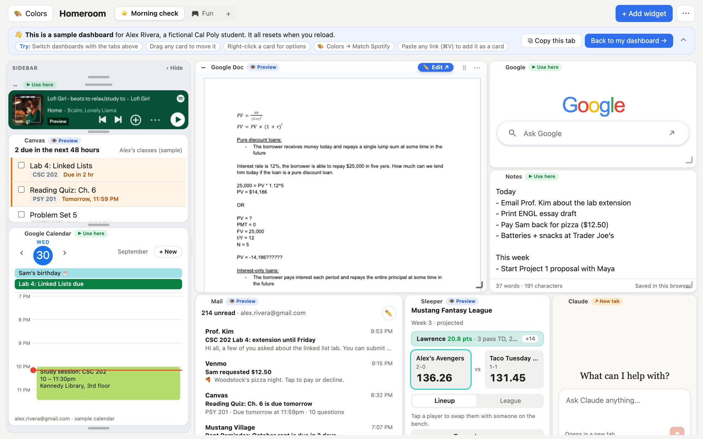
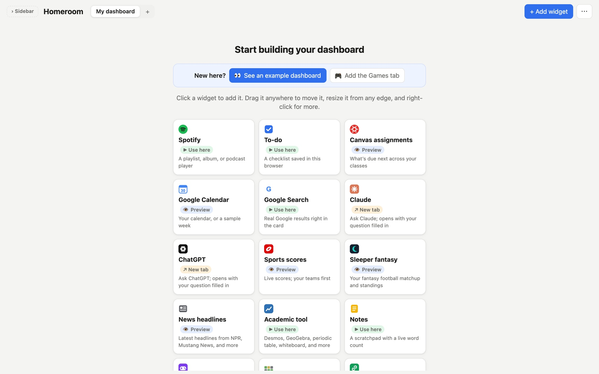
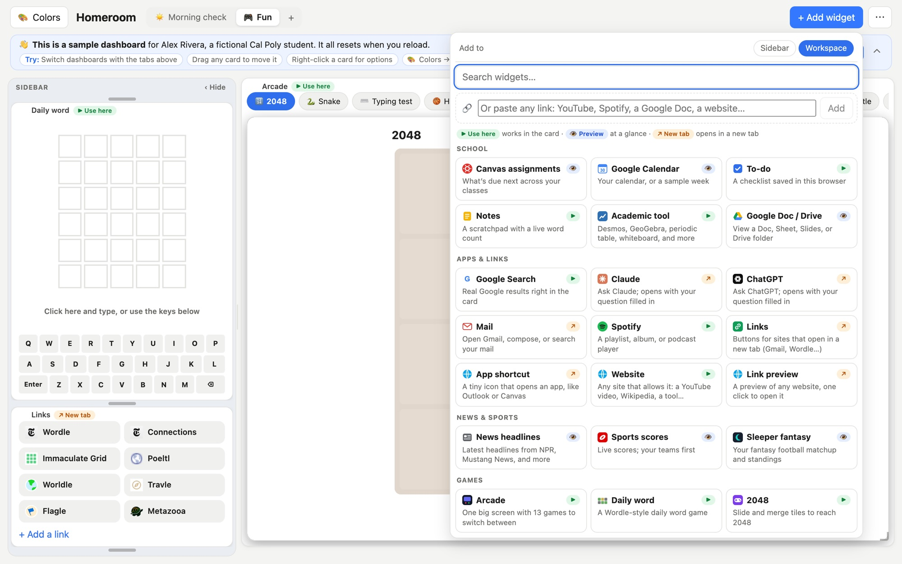
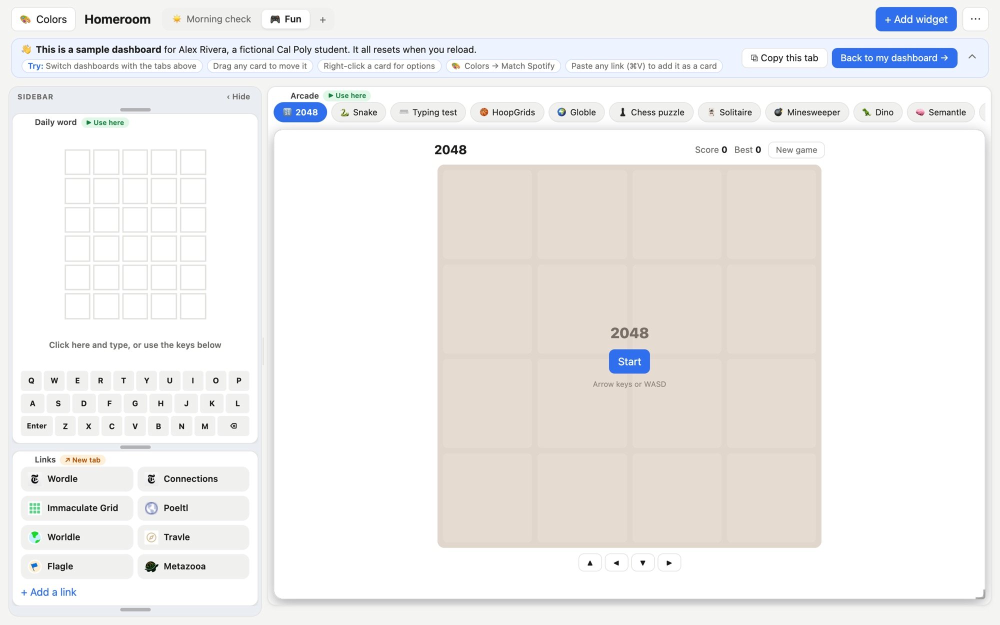

# Homeroom

**Where your school day starts.**

A college day starts with a dozen tabs: Canvas, Gmail, your calendar, Spotify, the group chat, and a few more.
Homeroom puts them on one screen, like home-screen widgets on your phone but for your laptop. Add the widgets you
want, drag them around, resize them, and your layout is there the next time you open it. No account needed.

**Try it: [thehomeroom.vercel.app](https://thehomeroom.vercel.app)**. Press **See an example dashboard** to look
around a sample dashboard for Alex Rivera, a fictional Cal Poly student.



## What it does

- **Widgets for the whole day.** Canvas assignments, Google Calendar, a to-do list, notes, Spotify, Gmail and
  Outlook, Google Search, Claude and ChatGPT, news headlines, sports scores, Sleeper fantasy football, Google Docs
  and Drive, Desmos and other academic tools, and more.
- **Your layout, your way.** Drag any card to move it, resize it from any edge, and right-click for options. Keep
  favorites in a collapsible sidebar and spread the rest across the workspace.
- **Several dashboards.** Make separate tabs for class, a project, or downtime, or start from a template like
  ☀️ Morning check (to-dos, calendar, due dates, news) or 💻 Project (music, tasks, notes, Claude).
- **Paste any link to make a card.** A YouTube video, a Spotify playlist, a Google Doc or any website becomes a card.
  Sites that can't be shown inside a card get a link preview instead.
- **A Fun tab.** An arcade of 13 games (2048, Snake, Minesweeper, chess puzzles, a typing test and more), a daily
  word game, and links to the daily puzzles everyone plays.
- **Colors that match.** Pick a color theme, or match it to your Spotify playlist's colors in one click.
- **On every device.** Optionally sign in with Google to keep your dashboard in sync between your laptop and phone.

| Start from any widget | Add anything |
| --- | --- |
|  |  |



## How it works

- **No accounts by default.** Your dashboards, widgets and settings are saved in your browser. Signing in with
  Google is only needed for syncing across devices or connecting Google features.
- **Real data where it's allowed.** Most big sites (Canvas, Gmail, Google) block being shown inside another page,
  so each widget is either an official embed, a widget that fetches the data and shows it itself, or a quick launcher
  that opens the real site.
- **Small server functions** fetch things browsers can't fetch directly: your Canvas and Google Calendar feeds,
  news headlines, link previews, and Spotify's player colors. Each one only fetches the sites it's meant to, so none
  of them can be used as an open proxy.
- **Private by design.** Your Canvas and calendar feed links stay in your own browser and are never logged.

## Built with

- [React](https://react.dev) and [Vite](https://vite.dev)
- [react-grid-layout](https://github.com/react-grid-layout/react-grid-layout) for dragging and resizing,
  [react-resizable-panels](https://github.com/bvaughn/react-resizable-panels) for the sidebar
- [Vercel](https://vercel.com) Functions in `api/`, with Upstash Redis for signed-in sync
- Hosted on Vercel, redeployed on every push to `main`

Built in four days for Cal Poly Vibe Coding's Build Day #1 ([the rules](BUILD_DAY.md)).

## Run it locally

```bash
npm install
npm run dev     # open the address it prints
```

The `api/` functions run on Vercel. To try them locally, use `vercel dev` instead.
